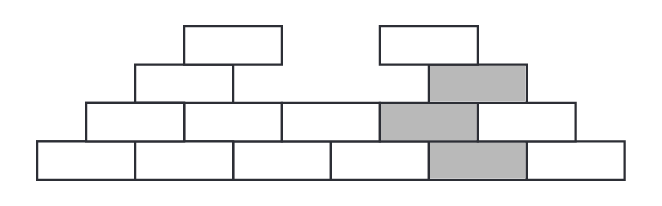
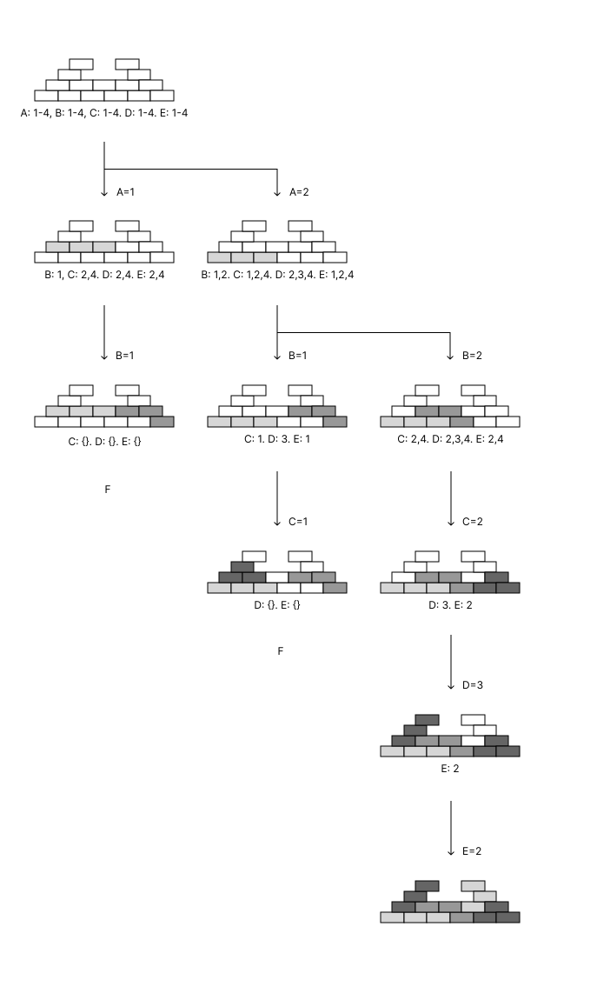

****# 2019
## 1.
### 1.a.

Is admissible(at least for this specific graph), since every nodes has a shortest path longer than the heuristic at that node.

Is valid, because $h$ is never negative.

### 1.b.

triangle inequality

### 1.c.

|   | <f, g, h, X>                                                     |
|:-:|:-:                                                               |
| 0 | <13, 0, 13, A>                                                   |
| 1 | <13, 2, 11, C>, <15, 6, 9, B>                                    |
| 2 | <13, 6, 7, D>, <14, 5, 9, B>, <14, 10, 4, E>                     |
| 3 | <13, 9, 4, E>, <14, 14, 0, F>, <14, 5, 9, B>                     |
| 4 | <13, 13, 0, F>, <14, 5, 9, B>                                    |

## 2.

### 2.a.
#### 2.a.1.

(1) $(X \land Y) \implies \neg Z \land \neg W$

(2) $(\neg X \lor \neg Y) \implies W$

#### 2.a.2.

(1)

$(X \land Y) \implies \neg Z \land \neg W$

$\equiv \neg (X \land Y) \lor (\neg Z \land \neg W)$ [implication elimination]

$\equiv (\neg X \lor \neg Y) \lor (\neg Z \land \neg W)$ [De Morgan]

$\equiv (((\neg X \lor \neg Y) \lor \neg Z) \land ((\neg X \lor \neg Y) \lor \neg W))$ [distributivity of $\lor$ over $\land$]

$\equiv (\neg X \lor \neg Y \lor \neg Z) \land (\neg X \lor \neg Y \lor \neg W)$ [simplify brackets]

(2)

$(\neg X \lor \neg Y) \implies W$

$\equiv \neg (\neg X \lor \neg Y) \lor W$ [implication elimination]

$\equiv (X \land Y) \lor W$ [De Morgan]

$\equiv (W \lor X) \land (W \lor Y)$ [distributivity of $\lor$ over $\land$]

### 2.b

$\neg X \implies \neg Z \land \neg W$

$\equiv \neg (\neg Z \land \neg W) \implies X$ [contraposition]

$\equiv (Z \lor W) \implies X$ [De Morgan]

### 2.c.

$T: u \mapsto (i, l, h)$
|u       |var     |low     |high    |
|:-:     |:-:     |:-:     |:-:     |
|0       |5       |        |        |
|1       |5       |        |        |
|2       |4       |0       |1       |
|3       |4       |1       |0       |
|4       |3       |3       |0       |
|5       |2       |2       |4       |
|6       |1       |2       |5       |
|7       |1       |4       |1       |

### 2.d.

APPLY($\land$, 7, 6)

G
|$\land (u_1, u_2) \to u$|
|:-:                     |
|$\land (1,0) \to 0$     |
|$\land (0,1) \to 0$     |
|$\land (3,2) \to 0$     |
|$\land (0,0) \to 0$     |
|$\land (4,2) \to 0$     |
|$\land (1,1) \to 1$     |
|$\land (1,2) \to 2$     |
|$\land (1,4) \to 4$     |
|$\land (1,5) \to 5$     |
|$\land (7,6) \to 8$     |

```
      | 8
      |
/\(7,6) Mk(1,0,5)
      |                                                                        
      |-------------------------------------------------+                
      |                                                  \               
  low | 0                                            high \ 5            
      |                                                    \             
/\(4,2) Mk(3,0,0)                                     /\(1,5) Mk(2,2,4)
      |                                                     |                         
      |--------------------+                                |--------------------+    
      |                     \                               |                     \   
  low | 0               high \ 0                        low | 2               high \  4
      |                       \                             |                       \ 
/\(3,2) Mk(4,0,0)        /\(0,2) Mk(4,0,0)            /\(1,2) Mk(4,0,1)        /\(1,4) Mk(3,3,0)
      |        \               |        \                   |        \               |                    \  
  low | 0  high \ 0        low | 0  high \ 0            low | 0  high \ 1        low | 3              high \ 0
      |          \             |          \                 |          \             |                      \
  /\(1,0)      /\(0,1)     /\(0,0)      /\(0,1) c!    /\(1,0) c!    /\(1,1)    /\(1,3) Mk(4,0,1)         /\(1,0) c!
                                                                                     |        \   
                                                                                 low | 1  high \ 0
                                                                                     |          \ 
                                                                                /\(1,1) c!   /\(1,0) c!
```

### 2.e.

No.

x and not y and w satifies the bdd and is independent of z

## 3.
### 3.a.

No.

Counterexample:



### 3.b.

Pentagram

### 3.c.

$A = \{ 1, 2 \}$,
$B = \{ 1, 2 \}$

### 3.d.

There is always a value in one domain, that saticefies at least one value in another, therefore AC-3 will never remove a domain value in the revise function.

### 3.e.


